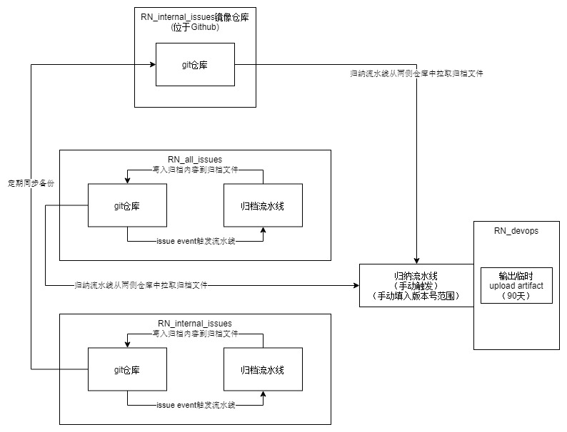
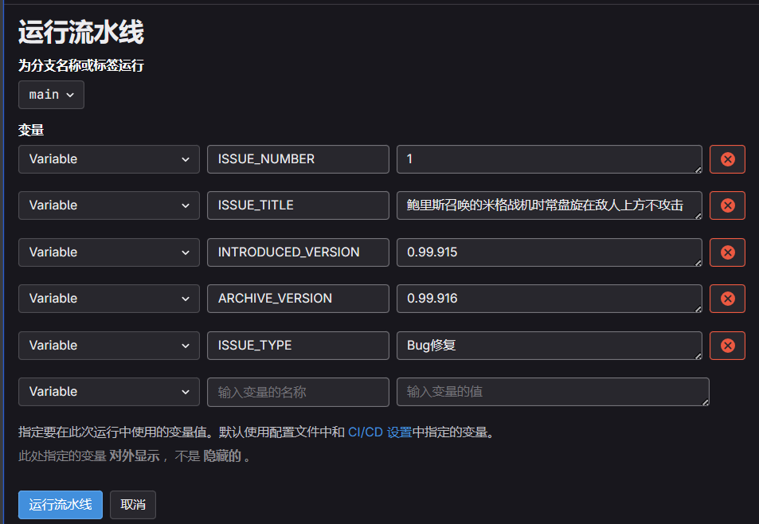
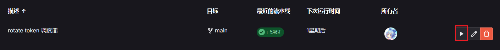
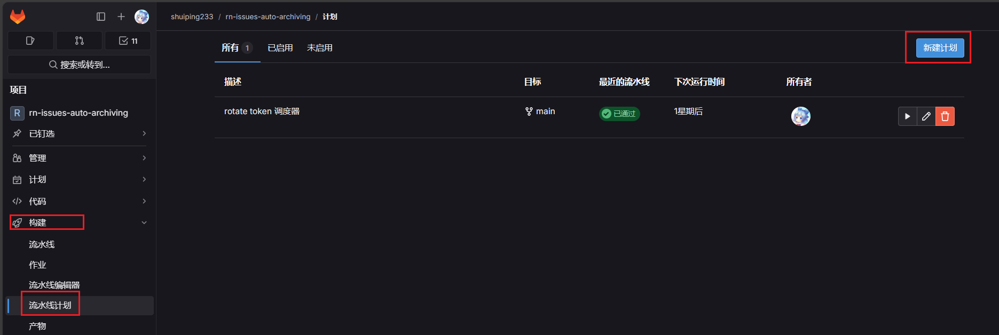
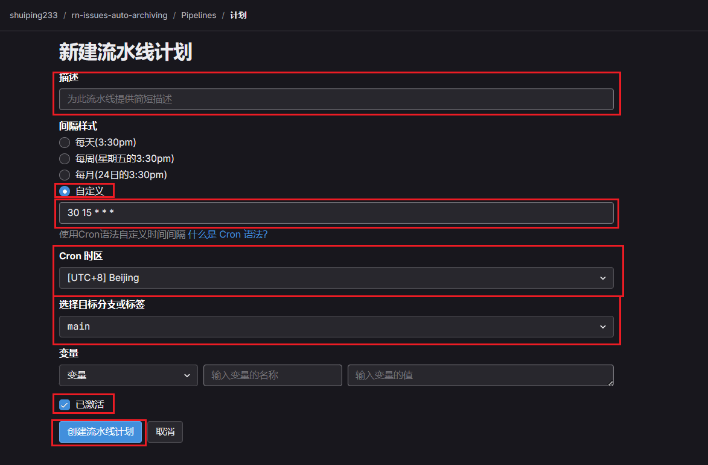

# 复仇时刻自动归档流水线

- 归档流水线将自动处理Issue关闭事件，并将被关闭的Issue信息格式化后写入归档文件后提交至仓库中。
- 归档流水线可以手动触发，若要手动触发归档流水线请参考下文[手动流水线相关变量](#手动流水线相关变量)

- 系统架构图：

# 手动流水线相关变量
## Github Action
- `Issue单号` 
    - 必填
    - 类型：正整数，不支持多个单号
- `Issue标题` 
    - 选填
    - 类型：字符串
    - 描述：此值将成为对应单号的Issue在归档文件中的描述，若为空则自动从Issue标题中获取
- `引入版本号` 
    - 选填
    - 类型：字符串
    - 描述：此值将成为对应单号的Issue在归档文件中的引入版本号，此值为空则自动从对应的Issue描述中获取引入版本号
- `归档版本号` 
    - 选填
    - 类型：字符串
    - 描述：此值将成为对应单号的Issue在归档文件中的归档版本号，此值为空则自动从对应的Issue评论中获取归档版本号
- `Issue类型` 
    - 选填
    - 类型：枚举选项
    - 描述：此值将成为对应单号的Issue在归档文件中的Issue类型，选择"自动判断"在自动从对应的Issue标签中获取Issue类型
    
## Gitlab CI
- 由于 Gitlab CI 需要手动填写流水线变量的键名，请手动运行归档流水线时将下述键名粘贴进流水线变量的`输入变量的名称`文本框中（选填变量不填写时可以直接不填键名），如下图所示

- `ISSUE_NUMBER` 
    - 必填
    - 类型：正整数，不支持多个单号
- `ISSUE_TITLE` 
    - 选填
    - 类型：字符串
    - 描述：此值将成为对应单号的Issue在归档文件中的描述，若为空则自动从Issue标题中获取
- `INTRODUCED_VERSION` 
    - 选填
    - 类型：字符串
    - 描述：此值将成为对应单号的Issue在归档文件中的引入版本号，此值为空则自动从对应的Issue描述中获取引入版本号
- `ARCHIVE_VERSION` 
    - 选填
    - 类型：字符串
    - 描述：此值将成为对应单号的Issue在归档文件中的归档版本号，此值为空则自动从对应的Issue评论中获取归档版本号
- `ISSUE_TYPE` 
    - 选填
    - 类型：字符串
    - 描述：此值将成为对应单号的Issue在归档文件中的Issue类型，可填“自动判断”以及归档文档中支持的Issue类型
 

# 部署/维护指南

- Python脚本全部位于`./src/`目录下
- Github流水线脚本全部位于`./.github/workflows/`目录下，配置文件则在`./.github/configs/`
- Gitlab流水线脚本全部位于`./gitlab-ci.yml`，配置文件则在`./.gitlab/configs/`
- 脚本配置文件`issue_processor.json`负责存储脚本处理Issue的行为，例如匹配所需的关键字，匹配Issue标签的类型等等。部分配置支持正则表达式，具体详情参见下文[Config配置](#Config配置)

## github侧

- github侧什么都不需要做，完成流水线yml的部署即可

## gitlab侧

- 需要部署/管理的仓库变量：

    |变量名|变量类型|描述|
    |---|---|---|
    |TOKEN|secret|此token用于获取Issue信息，需要个人账号的PAT（个人访问令牌）的`API读写权限`和`仓库读写权限`|
    
- 现有生产环境下，使用的是`RN-Bot`账号的PAT，如果PAT失效或者异常，请联系拥有`RN-Bot`账号管理权限的管理员

- webhook配置
    - 由于gitlab ci 无法直接由Issue事件激活，所以需要配置webhook来激活gitlab ci归档流水线
    - 具体完整配置流程可参考 [Gitlab文档：Trigger pipelines by using the API](https://docs.gitlab.com/ee/ci/triggers/)
    - 配置说明：
        - 在Gitlab仓库页面左侧菜单栏的`Settings（设置）`里的`CI/CD`选项里找到`Pipeline trigger tokens（流水线触发令牌）`页面，创建一个“流水线触发器token”，这个token是不会过期的
        - 然后再`Webhooks`中点击`Add new webhook （添加新的webhook）`按钮，创建新的webhook
        - webhook的url请按照如下格式填写：
        `https://{GITLAB_HOST}/api/v4/projects/{PROJECT_ID}/trigger/pipeline?token={TOKEN}&ref={BRANCH_NAME}`
        - `{GITLAB_HOST}` ：替换为gitlab实际域名
        - `{PROJECT_ID}` ： 替换为仓库的ID，可通过gitlab仓库首页复制
        - `{TOKEN}` ： 替换为刚刚获取的`Pipeline trigger tokens（流水线触发令牌）`）
        - `{BRANCH_NAME}` ： 替换为 `main` 即可，如果流水线文件放在其他分支了或者有其他需求，可以替换为仓库的其他分支名称或者仓库git标签名称

- PAT轮换流水线配置
    - 由于gitlab在某个版本后PAT不能设置成永不过期了，需要一个定时运行的任务自动轮换（rotate）PAT，所以通过`流水线任务`+`调度器（scheduler）`来完成这件事
    
    > [!NOTE]
    > 调度器可以手动运行，如图所示：
    
    - 配置说明：
        - 在Gitlab仓库页面左侧菜单栏的`Settings（设置）`里的`构建`选项里找到`流水线计划`选项，点击后进入新建流水线页面，点击页面右上角按钮`新建计划`
        
        - 填写新建流水线计划所需的信息，如下图所示
        
        - `描述`： 调度器在`流水线计划`页面显示的标题，标题清晰明了即可
        - `间隔样式`：选择`自定义`按钮 ，一个月执行一次足以（不会crontab语法可以参考使用 [crontab在线工具](https://tool.lu/crontab/) ）例如每隔30天的凌晨2点执行一次`0 2 */30 * *`。token轮换流水线默认轮换3个月（93天）后过期的token，如果你想调整轮换token的过期时间，请修改[RotateAccessToken.yml](.gitlab/workflows/RotateAccessToken.yml)的`TOKEN_TTL_DAYS`值
        - `Cron时区`： 选`[UTC+8] Beijing`即可
        - `已激活`： 必须勾选这个复选框，创建之后调度器自动按照间隔时间触发流水线

# Config配置
- `issue_processor.json`负责定义Issue信息收集相关内容
    |变量名|变量类型|正则表达式支持|描述|
    |---|---|---|---|
    |version_regex|str|是|匹配版本号的正则表达式，最外层必须有一对小括号`()`，因为这个值会被其他值引用|
    |introduced_version_reges|list[str]|是|匹配Issue描述中引入版本号的正则表达式，填写多个正则表达式流水线会用每个正则都匹配一次，直到匹配成功|
    |issue_type.type_keyword|dict[str,str]|否|匹配Issue标题中Issue类型关键字的字典，用来转换成归档内容中的Issue类型文本，由于不再通过Issue标题判断Issue类型，此项可以无视|
    |issue_type.need_introduced_version_issue_type|list[str]|否|归档时需要`引入版本号`的Issue类型，填写的内容为归档文档中定义的Issue类型，可填多个，匹配到任意一个即要求Issue描述中带有`引入版本号`，若Issue属于列表中的Issue类型但Issue描述中没有找到`引入版本号`，则归档流水线会报错并reopen此Issue|
    |issue_type.label_map|dict[str,str]|否|Issue标签（labels）映射为归档文档中定义的Issue类型，流水线通过这个字典来判断Issue是什么类型的，key为Issue标签名称，value为归档文档中定义的Issue类型名称|
    |white_list.labels|list[str]|否|归档所必须的Issue标签，流水线会检查issue是否包含这些标签，若不包含则报错并reopen此Issue。若填写多个Issue标签，则Issue必须同时具有这些标签才可以被流水线归档|
    |white_list.comments|list[str]|是|从Issue评论中匹配`归档版本号`的正则表达式，可组合引用`{version_regex}`。若流水线用任意一个列表内的正则均无法在Issue评论中匹配成功，则报错并reopen此Issue|
    |black_list.labels|list[str]|否|保留字段，暂未实现功能|
    |black_list.comments|list[str]|是|保留字段，暂未实现功能|

- `auto_archiving.json`负责定义Issue归档格式相关内容
    |变量名|变量类型|正则表达式支持|描述|
    |---|---|---|---|
    |rjust_space_width|int|否|归档内容中的描述部分的目标字符的长度，若归档内容描述的字符长度不够会用空格填充，具体位置请见`archive_template`的定义|
    |rjust_character|str|否|`rjust_space_width`填充的字符，空格即可|
    |table_separator|str|否|用来区分归档列表每一项的分隔符，由于归档文档是markdown列表格式，所以`\|`即可|
    |archive_template|str|否|归档内容的标准模版，定义了流水线归档内容的格式，可用的预定义变量有`{table_id}` `{issue_type}` `{issue_title}` `{rjust_space}` `{issue_repository}` `{issue_id}` `{introduced_version}` `{archive_version}`|
    |archive_document_path|str|否|归档文档的路径，流水线会读取归档文档并将内容写入该路径|
    |issue_title_processing_rules|dict[str,dict[str,str\|list]]|否|Issue标题预处理规则，用来对特定类型的Issue标题进行文本的添加或者修改，第一层key为Issue类型，第二层key是固定的，必须要填写`add_prefix` `add_suffix` `remove_keyword`，`add_prefix`是在Issue标题前添加的字符串，`add_suffix`是在Issue标题后添加的字符串，`remove_keyword`是Issue标题中若存在匹配的关键字则删除这些关键字|

# 开发
## 测试环境

- 为了方便本地测试，项目引入了`python-dotenv`模块，它提供了读取本地`.env`文件内容并立刻设置为环境变量的能力

- 环境需求：
    - Python : 3.10 或以上
    - IDE : visual studio code
    - `pip install ./develop-requirements.txt`
    - 一个符合脚本运行所需的`.env`文件内容，请参考`example.env`编写`.env`，并将`.env`文件放入`项目根目录`目录下

- 项目包含了`launch.json`文件，可以快速启动项目进行调试，在VSCode`运行与调试页`面可以选择调试的项目，选择对应启动项后按下`F5`即可启动调试
- vsc项目启动项分别有
    - github issue_processor （gitlab归档流水线第一步，用于整理issue信息和判断issue是否满足归档条件）
    - gitlab issue_processor （gitlab归档流水线第一步，用于整理issue信息和判断issue是否满足归档条件）
    - auto_archiving  （归档流水线第二步，将上一步整理好的issue内容格式化成新归档内容写入归档文档）
    - ~~push_document github~~ github侧的“提交归档文件”部分是shell脚本[push_document.sh](src/push_document.sh)完成的，所以无需使用python解释器进行调试
    - push_document gitlab （gitlab测归档流水线第三步，使用gitlab RESTful API 将新归档文档提交到仓库中）
    - check_config （检查config文件夹下的json文件格式是否正确的脚本，push和pr事件会触发这个检查流水线）

## 代码提交注意事项：
- 为了防止json配置文件因为某些原因写错了导致归档脚本出现异常，所以引入了检查json格式的流水线，提交或者pr之前请务必确保脚本相关的json配置文件格式是正确的

## 相关文档：

- 流水线dispatch（Restful API触发流水线）
    - Github ： https://docs.github.com/zh/rest/using-the-rest-api/getting-started-with-the-rest-api?apiVersion=2022-11-28#example-request-using-query-parameters
    - Gitlab ： https://docs.gitlab.com/ee/ci/triggers/#use-a-webhook
