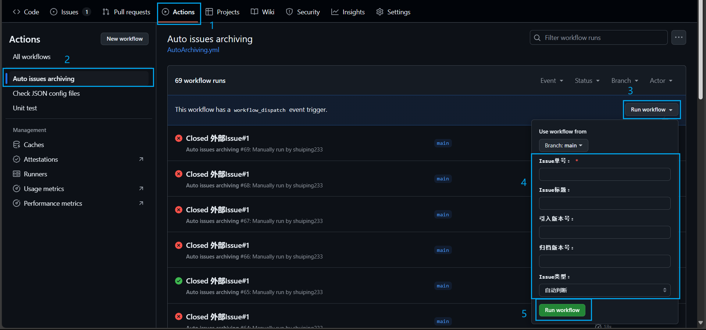
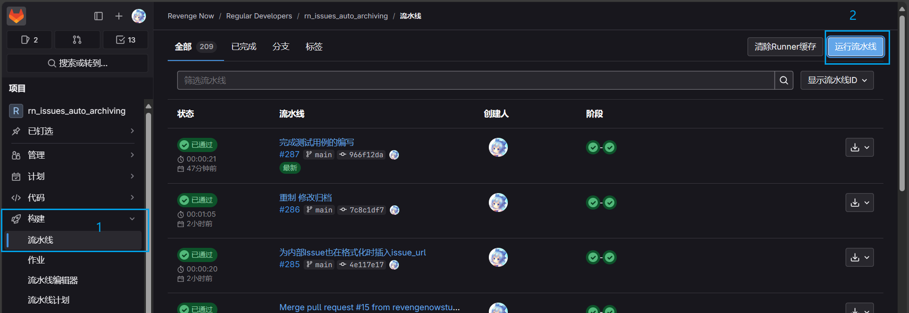
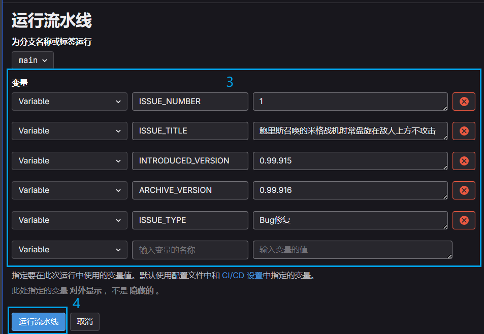
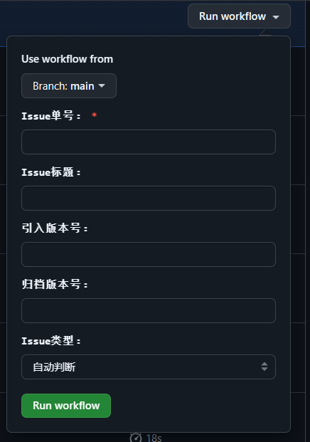
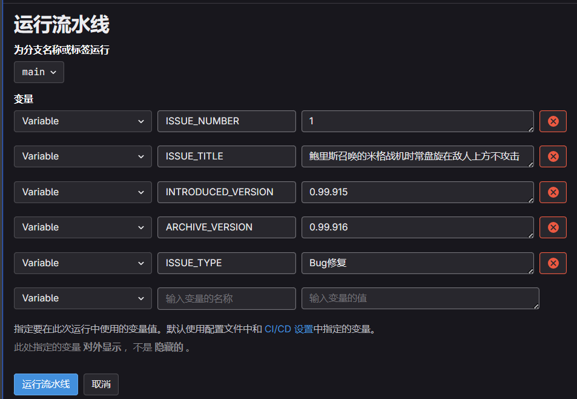

# 手动运行归档流水线

- 归档流水线可以被手动触发，且手动触发归档流水线时会跳过判断一些自动归档时说必须的条件
- 手动触发流水线有以下功能：
  - 覆盖模式：若目标Issue已经在归档文件中存在记录，则流水线会使用新输入的内容覆盖原有的记录。
  - 无视某些标签：**若所有变量都被手动填入了有效值**，则会跳过部分Issue标签的判断，直接使用手动输入的值执行归档流程。例如跳过判断“resolved 已解决”标签
  - 自动补全缺失的信息：若手动运行流水线时没有填入所有的变量，流水线会自动补全缺失的信息。例如，若手动输入了Issue标题，则流水线会自动从Issue描述中获取引入版本号和归档版本号。

> [!WARNING]
> 除非特殊情况，否则请优先使用自动归档流程来归档Issue

> [!WARNING]
> 不建议运行手动流水线时特意将非必须变量留空。因为既然要通过流水线自动获取Issue信息了，为什么不直接去使用自动归档流程或者自己把变量填完整呢？

- Github流水线执行流程：
  1. 进入`Actions`标签页 
  2. 点击`Auto issues archiving`流水线 
  3. 点击`Run workflow`下拉列表按钮 
  4. 在下拉列表中填写流水线变量所需的值 
  5. 点击`Run workflow `按钮执行流水线
  - 
- Gitlab流水线执行流程：
  1. 进入`构建`标签的`流水线`页面 
  2. 点击`运行流水线`按钮 
  3. 在`运行流水线`页面中填写流水线变量名称和变量所需的值 
  4. 点击`运行流水线`按钮执行流水线 
  - 
  - 

## 手动流水线相关变量
### Github Action
- 示例图片：  

- `Issue单号` 
    - 必填
    - 类型：正整数，不支持多个单号
- `Issue标题` 
    - 选填
    - 类型：字符串
    - 描述：此值将成为对应单号的Issue在归档文件中的描述，若为空则自动从Issue标题中获取
- `引入版本号` 
    - 选填
    - 类型：字符串
    - 描述：此值将成为对应单号的Issue在归档文件中的引入版本号，此值为空则自动从对应的Issue描述中获取引入版本号
- `归档版本号` 
    - 选填
    - 类型：字符串
    - 描述：此值将成为对应单号的Issue在归档文件中的归档版本号，此值为空则自动从对应的Issue评论中获取归档版本号
- `Issue类型` 
    - 选填
    - 类型：枚举选项
    - 描述：此值将成为对应单号的Issue在归档文件中的Issue类型，选择"自动判断"在自动从对应的Issue标签中获取Issue类型
    
### Gitlab CI
- 由于 Gitlab CI 需要手动填写流水线变量的键名，请手动运行归档流水线时将下述键名粘贴进流水线变量的`输入变量的名称`文本框中（选填变量不填写时可以直接不填键名），如下图所示

- `ISSUE_NUMBER` 
    - 必填
    - 类型：正整数，不支持多个单号
- `ISSUE_TITLE` 
    - 选填
    - 类型：字符串
    - 描述：此值将成为对应单号的Issue在归档文件中的描述，若为空则自动从Issue标题中获取
- `INTRODUCED_VERSION` 
    - 选填
    - 类型：字符串
    - 描述：此值将成为对应单号的Issue在归档文件中的引入版本号，此值为空则自动从对应的Issue描述中获取引入版本号
- `ARCHIVE_VERSION` 
    - 选填
    - 类型：字符串
    - 描述：此值将成为对应单号的Issue在归档文件中的归档版本号，此值为空则自动从对应的Issue评论中获取归档版本号
- `ISSUE_TYPE` 
    - 选填
    - 类型：字符串
    - 描述：此值将成为对应单号的Issue在归档文件中的Issue类型，可填“自动判断”以及归档文档中支持的Issue类型