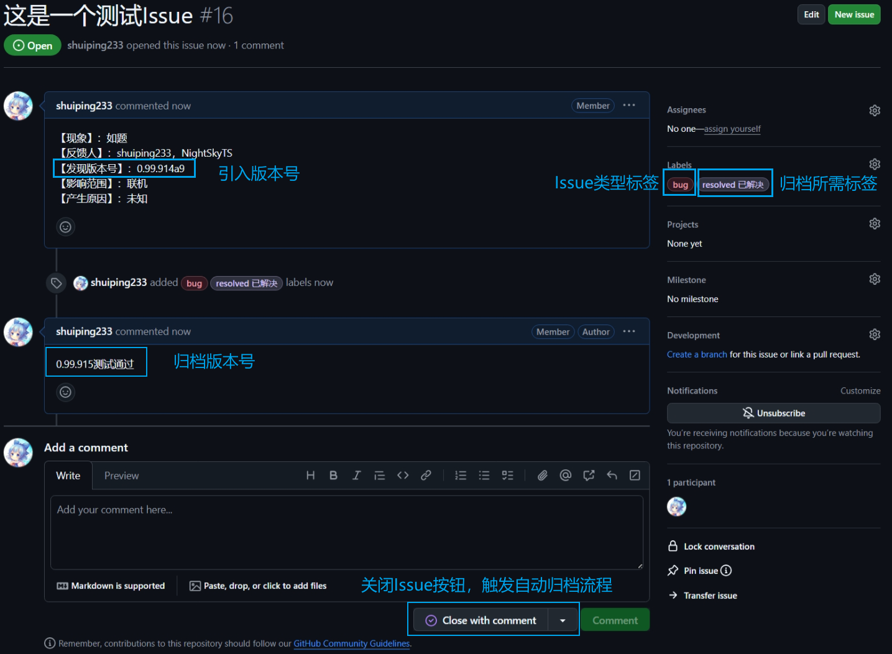
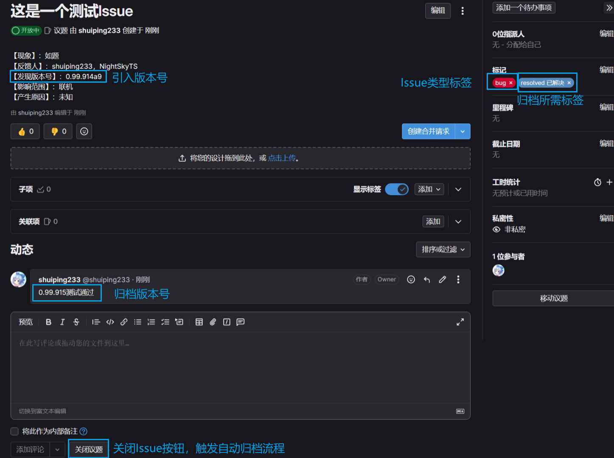

# 自动运行归档流水线

- 自动归档流水线并非完全自动，仍然需要人工操作或者补充某些内容，因为自动归档流水线需要从Issue内容中收集必要信息才能正常执行归档流程。而不满足归档条件时会发送告警评论以提示Issue中还缺少什么归档必要的信息
- 若自动归档流程中发生异常或者条件不满足时，除了在对应Issue下发送告警评论，Issue还会被重新打开（reopen）以方便用户再次关闭Issue触发自动归档流程

- 仍需人工补充在Issue中的信息有：
  - 归档所需标签：`resolved 已解决`
  - Issue类型标签：`bug` 或 `enhancement 优化与建议` 或 `task 任务`
  - 在Issue中存在包含归档版本号评论：`0.99.915测试通过` 或 `已验证，版本号：0.99.915`
  
> [!WARNING]
> 如果Issue中存在`bug`标签，则Issue描述中必须存在类似`【发现版本号】：xxxxx`类似的关键字，否则归档流水线会发送告警评论提示`找不到引入版本号`

> [!NOTE]
> 如果Issue中同时缺少上述3个信息，那么`Close issue`时，归档流程会无视此Issue，此Issue会被关闭且不会被归档，因为归档流程不认为此Issue是需要归档的对象

- 当Issue中存在上述内容后，点击`Close issue`即可触发自动归档流程

## 示例图片

### Github Issue

### Gitlab Issue

